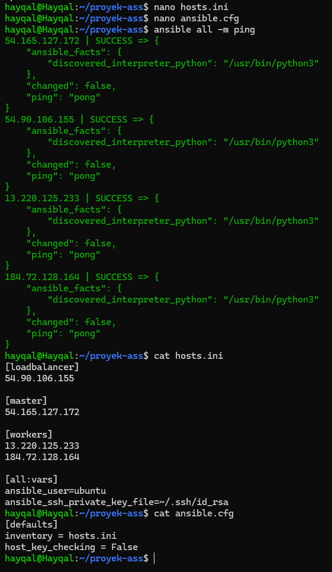
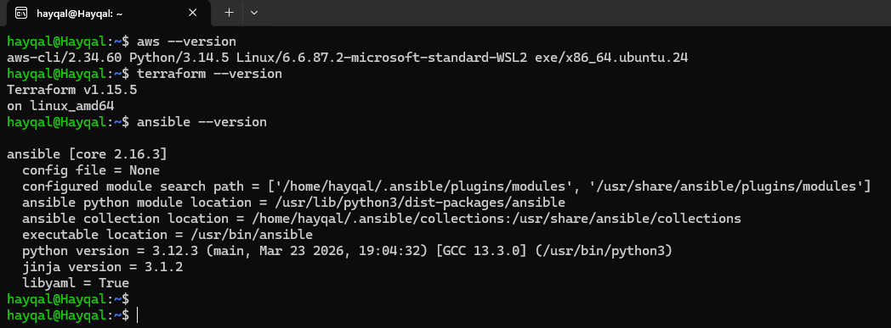
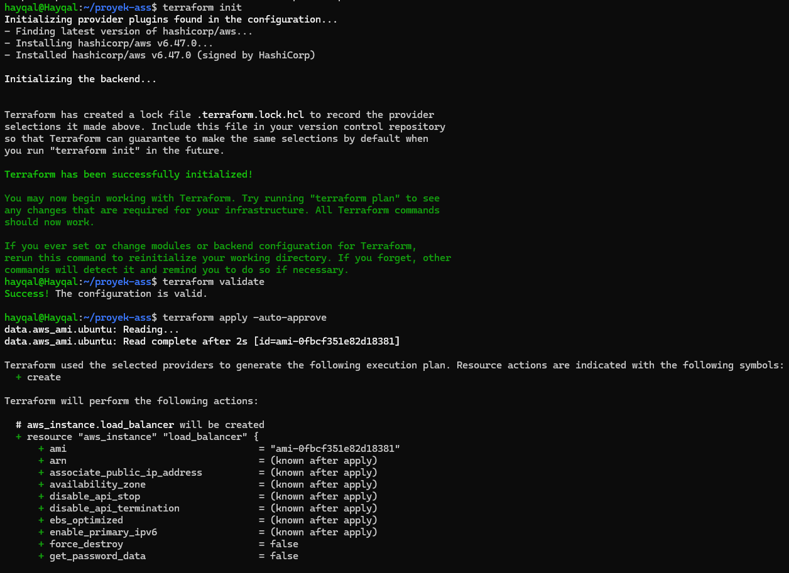
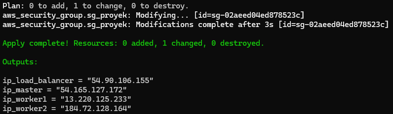
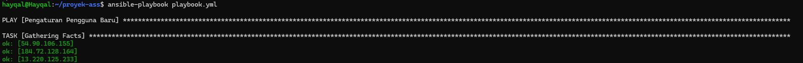

# ☸️ High-Availability Web Server Infrastructure on AWS with Kubernetes (K3s), Terraform & Ansible


<p align="center">
  
  
  
  
  
  
  
</p>

---

## 📌 Overview

This project demonstrates the end-to-end automated provisioning and configuration of a **production-grade, highly-available web server cluster** on **AWS Cloud**, implemented entirely through **Infrastructure as Code (IaC)** principles — eliminating all manual intervention and human error from the deployment pipeline.

The infrastructure spans four AWS EC2 `t2.micro` nodes (Ubuntu 24.04) managed by:
- **[Terraform](https://www.terraform.io/)** — provisions the cloud infrastructure blueprint declaratively (VMs, networking, security groups, SSH keys).
- **[Ansible](https://www.ansible.com/)** — configures all nodes automatically via a single playbook run (users, LVM storage, K3s Kubernetes cluster, Nginx deployment, and HAProxy load balancing).
- **[K3s](https://k3s.io/)** — lightweight Kubernetes distribution for container orchestration with minimal resource footprint.
- **[HAProxy](http://www.haproxy.org/)** — acts as the front-end traffic distributor, applying `roundrobin` load balancing to the two Kubernetes worker nodes.

### 🌟 Key Highlights
- **Zero-touch deployment:** The entire 4-node cluster is provisioned and configured with **3 commands** (`terraform init`, `terraform apply`, `ansible-playbook`).
- **High Availability (Fault-Tolerant):** If one worker node fails, HAProxy automatically redirects all traffic to the remaining healthy worker — service stays online without manual intervention.
- **Reproducibility:** Infrastructure is fully codified; the complete environment can be rebuilt from scratch identically at any time.
- **Cost-Optimized Teardown:** `terraform destroy` cleanly removes all 4 EC2 instances, EBS volumes, security groups, and SSH keys — no zombie resources accumulate in AWS billing.
- **LVM Storage Provisioning:** Worker nodes include a dedicated 5 GB `gp3` EBS volume partitioned and mounted via Logical Volume Manager (LVM) for persistent application data.

---

## 🏗️ System Architecture


```
Internet / Users
       │
       ▼
 ┌─────────────────────────────────────┐
 │    AWS Security Group (Ports: 22,   │
 │    80, 6443, 30080, internal-all)   │
 └──────────────┬──────────────────────┘
                │
       ┌────────▼────────┐
       │  Node 1         │
       │  LOAD BALANCER  │  t2.micro | Ubuntu 24.04
       │  HAProxy :80    │  Public IP → Round-Robin
       └────────┬────────┘
        ┌───────┴────────┐
        ▼                ▼
 ┌──────────────┐  ┌──────────────┐
 │  Node 3      │  │  Node 4      │
 │  WORKER 1    │  │  WORKER 2    │  K3s Agents
 │  Nginx :30080│  │  Nginx :30080│  + LVM /data_app
 └──────┬───────┘  └──────┬───────┘
        └────────┬─────────┘
                 │ (K3s Cluster Network)
        ┌────────▼────────┐
        │  Node 2         │
        │  K3s MASTER     │  Kubernetes API Server
        │  :6443          │  + Nginx Deployment Manifest
        └─────────────────┘
```

---

## 📁 Repository Structure

```
k8s-ha-webserver-aws/
├── main.tf          # Terraform: provisions 4 EC2 nodes, Security Group, SSH Key on AWS
├── hosts.ini        # Ansible: node IP inventory (fill with Terraform output IPs)
├── ansible.cfg      # Ansible: runtime settings (inventory path, host key checking off)
├── playbook.yml     # Ansible: 6-play full automation playbook
│                    #   Play 1: Create admin_app user on all nodes
│                    #   Play 2: LVM storage setup on workers (EBS /dev/xvdf → /data_app)
│                    #   Play 3: Install K3s Master + extract join token
│                    #   Play 4: Join Workers to K3s cluster via token
│                    #   Play 5: Deploy Nginx (2 replicas) + NodePort Service on K3s
│                    #   Play 6: Install & configure HAProxy on Load Balancer node
├── assets/          # Implementation screenshots extracted from documentation
├── LICENSE
└── .gitignore
```

---

## 🛠️ Prerequisites & Setup

### Required Tools (on WSL Ubuntu / Linux)
```bash
# 1. AWS CLI
curl "https://awscli.amazonaws.com/awscli-exe-linux-x86_64.zip" -o "awscliv2.zip"
unzip awscliv2.zip && sudo ./aws/install

# 2. Terraform
wget -O- https://apt.releases.hashicorp.com/gpg | sudo gpg --dearmor -o /usr/share/keyrings/hashicorp-archive-keyring.gpg
echo "deb [signed-by=/usr/share/keyrings/hashicorp-archive-keyring.gpg] https://apt.releases.hashicorp.com $(lsb_release -cs) main" | sudo tee /etc/apt/sources.list.d/hashicorp.list
sudo apt update && sudo apt install terraform

# 3. Ansible
sudo apt update && sudo apt install ansible
```

### AWS Credentials
Configure your AWS Academy / IAM credentials:
```bash
# ~/.aws/credentials
[default]
aws_access_key_id     = YOUR_ACCESS_KEY_ID
aws_secret_access_key = YOUR_SECRET_ACCESS_KEY
aws_session_token     = YOUR_SESSION_TOKEN   # (if using AWS Academy)

# ~/.aws/config
[default]
region = us-east-1
```

Validate your connection:
```bash
aws sts get-caller-identity
aws ec2 describe-availability-zones --region us-east-1 --output table
```

---

## 🚀 Deployment Guide (Step-by-Step)

### Step 1 — Prepare Project Workspace & SSH Key Pair
```bash
mkdir -p ~/proyek-ass && cd ~/proyek-ass
ssh-keygen -t rsa -b 2048 -f ~/.ssh/id_rsa -q -N ""
```

### Step 2 — Provision AWS Infrastructure with Terraform
```bash
# Initialize Terraform (downloads AWS provider plugin)
terraform init

# Validate the configuration syntax
terraform validate

# Deploy the 4-node infrastructure to AWS
terraform apply -auto-approve
```

After `apply` completes, **note the 4 public IP addresses** printed as output:
```
ip_load_balancer = "54.90.xxx.xxx"
ip_master        = "54.165.xxx.xxx"
ip_worker1       = "13.220.xxx.xxx"
ip_worker2       = "184.72.xxx.xxx"
```

### Step 3 — Configure `hosts.ini` with the Terraform Output IPs
Replace the placeholder values in `hosts.ini` with the actual IPs:
```ini
[loadbalancer]
54.90.xxx.xxx

[master]
54.165.xxx.xxx

[workers]
13.220.xxx.xxx
184.72.xxx.xxx

[all:vars]
ansible_user=ubuntu
ansible_ssh_private_key_file=~/.ssh/id_rsa
```

### Step 4 — Test Ansible Connectivity
```bash
ansible all -m ping
```
Expected: All nodes return `"ping": "pong"`.

<p align="center">
  
</p>

### Step 5 — Run the Automation Playbook
```bash
ansible-playbook playbook.yml
```

<p align="center">
  
</p>

### Step 6 — Validate the Deployment
Open a browser and navigate to your **Load Balancer's public IP**:
```
http://<LOAD_BALANCER_PUBLIC_IP>/
```
You should see the **Nginx Welcome Page**, confirming the full chain is operational.

<p align="center">
  
</p>

---

## 📸 Implementation Evidence

| AWS CLI Installation Verification | Terraform Apply Output (4 Node IPs) |
| :---: | :---: |
|  |  |

| Ansible Ping – All Nodes Reachable | Playbook Execution Output |
| :---: | :---: |
|  |  |

---

## 🧠 Challenges & Solutions

| # | Problem Encountered | Root Cause | Resolution |
|:--:|:---|:---|:---|
| 1 | Master Node unreachable during Ansible playbook | EC2 instance not yet fully booted when Ansible ran | Added retry logic; waited for boot completion |
| 2 | K3s crashed: `connection refused` on all worker attempts | RAM exhaustion on 1GB `t2.micro` — K3s agent overloaded the master node CPU by 39% | Injected 2GB virtual RAM via swap file: `fallocate -l 2G /swapfile` → `swapon` |
| 3 | Ansible HAProxy task failed with `src and dest required` | `template` module requires an external `.j2` file as source | Switched to `copy` module with inline `content:` block — no external file needed |
| 4 | HTTP 503 Service Unavailable when accessing Load Balancer | Port `30080` (Nginx NodePort) was missing from the AWS Security Group ingress rules | Added port `30080` ingress rule to `main.tf` and re-applied: `terraform apply -auto-approve` |

---

## 💡 High Availability Validation

The fault-tolerant capability was verified by intentionally stopping Nginx on one worker node. The remaining node continued to serve the **Nginx Welcome Page** uninterrupted, confirming the architecture's **fault-tolerant** and **high-availability** properties under the HAProxy `roundrobin` load balancing algorithm.

---

## 🧹 Infrastructure Teardown (Cost Optimization)
When the environment is no longer needed, destroy all AWS resources instantly:
```bash
terraform destroy -auto-approve
```
This removes all 4 EC2 instances, EBS volumes, the Security Group, and the SSH key pair — no zombie resources remain.

---

## 👥 Contributors

- **Hayqal Husein Alhabsyi**
- **Muhammad Raihan Aqeela Akbar**
- **Muhammad Syamsu Falah**
- **Muhammad Aushaf Farras**

---

## 📄 License

This project is licensed under the [MIT License](LICENSE) - free to use, modify, and distribute.
